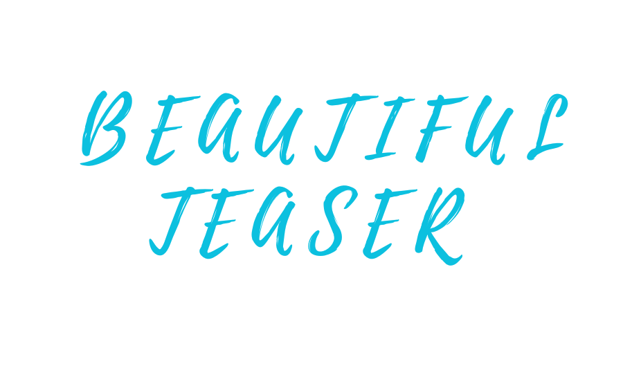

# TrackGo: A Flexible and Efficient Method for Controllable Video Generation

This repository contains the project page of our AAAI 2025 paper, "TrackGo: A Flexible and Efficient Method for Controllable Video Generation." This method offers users with a flexible and precise mechanism for manipulating video content.

